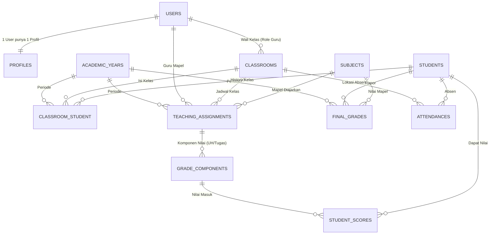

# Sistem Akademik Sekolah Dasar (SD)

<p align="center">
  
  
  
  
  
</p>

<p align="center">
  <strong>🏫 Sistem Manajemen Akademik Lengkap untuk Sekolah Dasar dengan Laravel</strong>
</p>

## 📋 Tentang Sistem

Sistem Akademik Sekolah Dasar adalah aplikasi web berbasis Laravel yang dirancang khusus untuk mengelola operasional sekolah dasar (SD) secara menyeluruh. Sistem ini mencakup manajemen profil pengguna, data siswa, kelas, jadwal mengajar, penilaian harian, absensi, hingga pembuatan rapor akhir semester.

### ✨ Fitur Utama

-   🔐 **Pemisahan Akun & Profil** - User login terpisah dari biodata guru/kepsek
-   👨‍🏫 **Manajemen Guru & Kepsek** - Profil lengkap dengan NIP, foto, dll
-   📚 **Sistem Kelas & Rombel** - Plotting siswa ke kelas per tahun ajaran
-   📅 **Jadwal Mengajar** - Assignment guru-mapel-kelas
-   📊 **Penilaian Terstruktur** - Nilai harian (UH/Tugas) vs rapor akhir
-   📝 **Absensi Siswa** - Tracking kehadiran harian
-   📄 **Pembuatan Rapor** - Kalkulasi nilai akhir otomatis
-   👥 **Role-Based Access** - Admin, Guru, Kepsek dengan permission berbeda
-   🎨 **UI Modern** - Responsive dengan Tailwind CSS
-   🧪 **Testing Lengkap** - Unit & Feature tests dengan Pest

## 🏗️ Arsitektur Sistem

### ERD (Entity Relationship Diagram)



## 🗄️ Struktur Database

### Migrasi Laravel (Urutan Pembuatan)

#### 1. Pengguna & Profil

```php
// users (Hanya Login)
Schema::create('users', function (Blueprint $table) {
    $table->id();
    $table->string('email')->unique();
    $table->string('password');
    $table->enum('role', ['admin', 'guru', 'kepsek']); // Admin tidak punya profile
    $table->timestamps();
});

// profiles (Biodata Guru & Kepsek)
Schema::create('profiles', function (Blueprint $table) {
    $table->id();
    $table->foreignId('user_id')->constrained('users')->onDelete('cascade');
    $table->string('nip')->nullable()->unique();
    $table->string('name');
    $table->string('phone')->nullable();
    $table->text('address')->nullable();
    $table->string('photo')->nullable();
    $table->timestamps();
});
```

#### 2. Data Master Sekolah

```php
// academic_years
Schema::create('academic_years', function (Blueprint $table) {
    $table->id();
    $table->string('name'); // "2024/2025"
    $table->enum('semester', ['ganjil', 'genap']);
    $table->boolean('is_active')->default(false);
    $table->timestamps();
});

// subjects (Mapel)
Schema::create('subjects', function (Blueprint $table) {
    $table->id();
    $table->string('name'); // Matematika, IPA
    $table->timestamps();
});

// students (Siswa)
Schema::create('students', function (Blueprint $table) {
    $table->id();
    $table->string('nis')->unique();
    $table->string('nisn')->nullable();
    $table->string('name');
    $table->enum('gender', ['L', 'P']);
    $table->date('birth_date');
    $table->text('address')->nullable();
    $table->string('parent_name')->nullable();
    $table->timestamps();
});

// classrooms (Kelas Fisik)
Schema::create('classrooms', function (Blueprint $table) {
    $table->id();
    $table->string('name'); // "1A", "6B"
    $table->integer('grade_level'); // 1 sampai 6
    // Wali Kelas diambil dari users (role guru)
    $table->foreignId('teacher_id')->nullable()->constrained('users')->onDelete('set null');
    $table->timestamps();
});
```

#### 3. Operasional (Plotting Kelas & Jadwal)

```php
// classroom_student (Siswa X masuk Kelas Y tahun ini)
Schema::create('classroom_student', function (Blueprint $table) {
    $table->id();
    $table->foreignId('student_id')->constrained()->onDelete('cascade');
    $table->foreignId('classroom_id')->constrained()->onDelete('cascade');
    $table->foreignId('academic_year_id')->constrained()->onDelete('cascade');
    $table->timestamps();
});

// teaching_assignments (Guru X mengajar Mapel Y di Kelas Z)
Schema::create('teaching_assignments', function (Blueprint $table) {
    $table->id();
    $table->foreignId('teacher_id')->constrained('users')->onDelete('cascade');
    $table->foreignId('classroom_id')->constrained()->onDelete('cascade');
    $table->foreignId('subject_id')->constrained()->onDelete('cascade');
    $table->foreignId('academic_year_id')->constrained()->onDelete('cascade');
    $table->timestamps();
});
```

#### 4. Transaksi Harian (Absensi & Input Nilai)

```php
// attendances
Schema::create('attendances', function (Blueprint $table) {
    $table->id();
    $table->foreignId('student_id')->constrained()->onDelete('cascade');
    $table->foreignId('classroom_id')->constrained()->onDelete('cascade');
    $table->date('date');
    $table->enum('status', ['H', 'S', 'I', 'A']);
    $table->string('note')->nullable();
    $table->timestamps();
});

// grade_components (Wadah Nilai: Guru buat "Slot" nilai dulu)
Schema::create('grade_components', function (Blueprint $table) {
    $table->id();
    // Relasi ke teaching_assignments agar spesifik (Guru A, Mapel B, Kelas C)
    $table->foreignId('teaching_assignment_id')->constrained()->onDelete('cascade');
    $table->string('name'); // "PR Bab 1", "UH 1"
    $table->enum('type', ['tugas', 'uh', 'uts', 'uas']);
    $table->timestamps();
});

// student_scores (Isi Nilai Siswa)
Schema::create('student_scores', function (Blueprint $table) {
    $table->id();
    $table->foreignId('grade_component_id')->constrained()->onDelete('cascade');
    $table->foreignId('student_id')->constrained()->onDelete('cascade');
    $table->float('score'); // 0 - 100
    $table->timestamps();
});
```

#### 5. Laporan (Nilai Akhir Rapor)

```php
// final_grades (Hasil kalkulasi untuk Rapor)
Schema::create('final_grades', function (Blueprint $table) {
    $table->id();
    $table->foreignId('student_id')->constrained()->onDelete('cascade');
    $table->foreignId('subject_id')->constrained()->onDelete('cascade');
    $table->foreignId('academic_year_id')->constrained()->onDelete('cascade');

    $table->float('final_score'); // Nilai Akhir Angka
    $table->string('letter_grade')->nullable(); // Predikat (A/B/C)
    $table->text('description')->nullable(); // Deskripsi Capaian

    $table->timestamps();

    // Constraint: 1 Siswa, 1 Mapel, 1 Tahun = Cuma boleh 1 Nilai Akhir
    $table->unique(['student_id', 'subject_id', 'academic_year_id']);
});
```

## 🔄 Alur Kerja Sistem (Workflow)

### Admin:

-   **Setup Awal**: Buat user guru & kepsek, data master (tahun ajaran, mapel, siswa)
-   **Plotting Tahunan**:
    -   Tentukan siswa masuk kelas mana (`classroom_student`)
    -   Tentukan guru mengajar apa di kelas mana (`teaching_assignments`)

### Guru:

-   **Absensi Harian**: Input ke `attendances`
-   **Penilaian Harian**:
    -   Buat "slot nilai" (UH/Tugas) → `grade_components`
    -   Input nilai siswa → `student_scores`
-   **Akhir Semester**: Generate rapor (hitung rata-rata → simpan ke `final_grades`)

### Kepsek:

-   **Monitoring**: Dashboard statistik
-   **Rapor**: Lihat/cetak rapor siswa dari `final_grades`

## 🚀 Panduan Instalasi

### Prasyarat

-   PHP 8.3+
-   Composer
-   Node.js & NPM
-   MySQL

### Langkah Instalasi

1. **Clone Repository**

    ```bash
    git clone <repository-url>
    cd sistem-akademik-sekolah
    ```

2. **Install Dependencies**

    ```bash
    composer install
    npm install
    ```

3. **Environment Setup**

    ```bash
    cp .env.example .env
    php artisan key:generate
    ```

4. **Database Configuration**
   Edit `.env`:

    ```env
    DB_CONNECTION=mysql
    DB_HOST=127.0.0.1
    DB_PORT=3306
    DB_DATABASE=sekolah_sd
    DB_USERNAME=your_username
    DB_PASSWORD=your_password
    ```

5. **Run Migrations & Seeders**

    ```bash
    php artisan migrate --seed
    ```

6. **Build Assets**

    ```bash
    npm run build
    ```

7. **Start Server**
    ```bash
    php artisan serve
    ```

Kunjungi `http://localhost:8000` untuk mulai menggunakan sistem!

## 👤 User Default

**Admin:**

-   Email: `admin@sekolah.com`
-   Password: `password`

**Guru:**

-   Email: `guru@sekolah.com`
-   Password: `password`

**Kepsek:**

-   Email: `kepsek@sekolah.com`
-   Password: `password`

## 📊 Status Pengembangan

### ✅ Sudah Selesai

-   [x] Sistem autentikasi dengan role (Admin/Guru/Kepsek)
-   [x] Manajemen profil pengguna (terpisah dari login)
-   [x] Upload foto profil
-   [x] Testing lengkap untuk fitur profil
-   [x] Clean Architecture (Controller → Service → Repository)
-   [x] UI responsif dengan Tailwind CSS

### 🚧 Dalam Pengembangan

-   [ ] Tahun Ajaran management
-   [ ] Master data siswa
-   [ ] Manajemen kelas & rombel
-   [ ] Jadwal mengajar
-   [ ] Sistem absensi
-   [ ] Penilaian harian
-   [ ] Generate rapor akhir

### 📋 Rencana Selanjutnya

-   Implementasi CRUD untuk semua entitas
-   Dashboard dengan statistik
-   Export rapor ke PDF
-   API untuk mobile app
-   Multi-tenant untuk multiple sekolah

## 🧪 Testing

```bash
# Jalankan semua test
php artisan test

# Test spesifik
php artisan test tests/Feature/ProfileTest.php
```

## 📚 Teknologi

-   **Backend**: Laravel 12
-   **Frontend**: Blade + Tailwind CSS + Alpine.js
-   **Database**: MySQL
-   **Testing**: Pest PHP
-   **Authentication**: Laravel Breeze + Spatie Permission

## 🤝 Kontribusi

Kontribusi sangat diterima! Silakan buat issue atau pull request.

## 📄 Lisensi

MIT License

---

<p align="center">
  <strong>Dibuat untuk memudahkan pengelolaan sekolah dasar ❤️</strong>
</p>

## 📋 Tentang BreezeShield

BreezeShield adalah aplikasi Laravel yang telah dikonfigurasi sebelumnya dan menyediakan fondasi yang solid untuk membangun aplikasi web modern. Dilengkapi dengan semua yang Anda butuhkan untuk mulai mengembangkan aplikasi dengan cepat - autentikasi, kontrol akses berbasis role, komponen UI yang indah, dan lainnya.

### ✨ Fitur Utama

-   🔐 **Sistem Autentikasi Lengkap** - Menggunakan Laravel Breeze
-   👥 **Manajemen Role & Permission** - Menggunakan Spatie Laravel Permission
-   📊 **Chart Interaktif** - Menggunakan Chart.js untuk visualisasi data
-   🎨 **UI Dashboard yang Indah** - Desain modern dan responsif
-   🔔 **Integrasi Sweet Alert** - Alert dan notifikasi yang cantik
-   📱 **Responsif Mobile** - Bekerja sempurna di semua perangkat
-   🎯 **Siap untuk Operasi CRUD** - Tinggal tambahkan logika bisnis Anda
-   🛡️ **Aman Secara Default** - Mengikuti praktik terbaik Laravel

## 🛠️ Stack Teknologi

-   **Backend**: Laravel 11.x
-   **Frontend**: Blade Templates + Tailwind CSS + Alpine.js
-   **Charts**: Chart.js 4.x
-   **Autentikasi**: Laravel Breeze
-   **Manajemen Role**: Spatie Laravel Permission
-   **Alert**: SweetAlert2
-   **Database**: MySQL/PostgreSQL/SQLite
-   **Build Tool**: Vite
-   **Styling**: Tailwind CSS + Komponen Custom

## 📦 Yang Sudah Disediakan

### 🔐 Sistem Autentikasi

-   Registrasi dan login pengguna
-   Fungsi reset password
-   Verifikasi email
-   Fungsi remember me
-   Manajemen profil

### 👥 Sistem Role & Permission

-   Role yang sudah dikonfigurasi (Admin, User)
-   Kontrol akses berbasis permission
-   Interface assignment role
-   Proteksi middleware

### 🎨 Komponen UI

-   **Layout Components** (`resources/views/components/layout/`)
    -   Layout dashboard modern
    -   Navigation responsif
    -   Sidebar dan header
-   **Auth Components** (`resources/views/components/auth/`)
    -   Form login dan register
    -   Komponen verifikasi email
-   **Form Components** (`resources/views/components/form/`)
    -   Input fields yang konsisten
    -   Button styles
    -   Form validation display
-   **UI Components** (`resources/views/components/ui/`)
    -   Cards dan panels
    -   Tables siap pakai
    -   Modals dan dialogs
-   **Home Components** (`resources/views/components/home/`)
    -   Hero section
    -   Feature highlights
    -   Call-to-action buttons

### 🔔 Sistem Notifikasi

-   Integrasi SweetAlert
-   Alert Success/Error/Warning
-   Notifikasi toast
-   Dialog konfirmasi

### 📊 Komponen Chart

-   Chart Todo Statistics (Doughnut)
-   Chart Progress Line
-   Chart Bar untuk statistik
-   Chart Umum yang customizable
-   Responsive dan interaktif

## 🚀 Panduan Cepat

### Prasyarat

-   PHP 8.2 atau lebih tinggi
-   Composer
-   Node.js & NPM
-   MySQL/PostgreSQL/SQLite

### Instalasi

1. **Clone repository**

    ```bash
    git clone https://github.com/username/breezeshield.git
    cd breezeshield
    ```

2. **Install dependensi PHP**

    ```bash
    composer install
    ```

3. **Install dependensi Node.js**

    ```bash
    npm install
    ```

4. **Setup environment**

    ```bash
    cp .env.example .env
    php artisan key:generate
    ```

5. **Konfigurasi database**
   Edit file `.env` dengan kredensial database Anda:

    ```env
    DB_CONNECTION=mysql
    DB_HOST=127.0.0.1
    DB_PORT=3306
    DB_DATABASE=breezeshield
    DB_USERNAME=username_anda
    DB_PASSWORD=password_anda
    ```

6. **Jalankan migrasi dan seeder**

    ```bash
    php artisan migrate --seed
    ```

7. **Build asset**

    ```bash
    npm run build
    ```

8. **Jalankan aplikasi**
    ```bash
    php artisan serve
    ```

Kunjungi `http://localhost:8000` untuk melihat aplikasi Anda!

## 👤 User Default

Setelah seeding, Anda dapat login dengan:

**User Admin:**

-   Email: `admin@example.com`
-   Password: `password`
-   Role: Admin

**User Biasa:**

-   Email: `user@example.com`
-   Password: `password`
-   Role: User

## 🎯 Cara Penggunaan

### Membuat Operasi CRUD

BreezeShield menyediakan fondasi yang solid. Untuk menambahkan operasi CRUD Anda sendiri:

1. **Buat Model dan Migration**

    ```bash
    php artisan make:model ModelAnda -mc
    ```

2. **Definisikan relasi dan fillable fields**

    ```php
    // app/Models/ModelAnda.php
    protected $fillable = ['nama', 'deskripsi'];
    ```

3. **Buat method Controller**

    ```php
    // app/Http/Controllers/ModelAndaController.php
    public function index()
    {
        $items = ModelAnda::paginate(10);
        return view('model-anda.index', compact('items'));
    }
    ```

4. **Tambahkan routes**

    ```php
    // routes/web.php
    Route::resource('model-anda', ModelAndaController::class)
        ->middleware(['auth', 'verified']);
    ```

5. **Buat views menggunakan komponen yang ada**

    ```blade
    {{-- resources/views/model-anda/index.blade.php --}}
    <x-app-layout>
        <x-slot name="header">
            <h2>Model Anda</h2>
        </x-slot>

        <!-- Konten Anda di sini -->
    </x-app-layout>
    ```

### Menambah Permission

1. **Buat permission**

    ```bash
    php artisan tinker
    ```

    ```php
    use Spatie\Permission\Models\Permission;
    Permission::create(['name' => 'kelola postingan']);
    ```

2. **Assign ke role**

    ```php
    $role = Role::findByName('admin');
    $role->givePermissionTo('kelola postingan');
    ```

3. **Proteksi routes**
    ```php
    Route::get('/posts', [PostController::class, 'index'])
        ->middleware(['auth', 'permission:kelola postingan']);
    ```

### Menggunakan Komponen Chart

BreezeShield menyediakan komponen chart siap pakai untuk visualisasi data:

1. **Chart Todo Statistics (Doughnut)**

    ```blade
    {{-- resources/views/dashboard.blade.php --}}
    <x-app-layout>
        <x-slot name="header">
            <h2>Dashboard</h2>
        </x-slot>

        <div class="grid grid-cols-1 md:grid-cols-2 gap-6">
            <x-chart.todo-stats :data="[
                'completed' => $completedTodos,
                'pending' => $pendingTodos,
                'in_progress' => $inProgressTodos
            ]" />
        </div>
    </x-app-layout>
    ```

2. **Chart Progress Line**

    ```blade
    <x-chart.progress-chart :data="$progressData" :labels="$progressLabels" />
    ```

3. **Chart Bar untuk Statistik**

    ```blade
    <x-chart.bar-chart
        :data="$barData"
        :labels="$barLabels"
        title="Statistik Bulanan"
    />
    ```

4. **Chart Umum Customizable**

    ```blade
    <x-chart.chart
        type="line"
        :data="$customData"
        :options="$customOptions"
    />
    ```

5. **Controller Example**

    ```php
    // app/Http/Controllers/DashboardController.php
    public function index()
    {
        $completedTodos = auth()->user()->todos()->where('status', 'completed')->count();
        $pendingTodos = auth()->user()->todos()->where('status', 'pending')->count();
        $inProgressTodos = auth()->user()->todos()->where('status', 'in_progress')->count();

        return view('dashboard', compact('completedTodos', 'pendingTodos', 'inProgressTodos'));
    }
    ```

## 📁 Struktur Project

```
laravel-12/
├── app/
│   ├── Http/
│   │   ├── Controllers/          # Controllers aplikasi
│   │   └── Requests/             # Form request validation
│   ├── Models/                   # Model Eloquent
│   ├── Policies/                 # Policy otorisasi
│   └── Providers/                # Service providers
├── bootstrap/
│   ├── app.php                  # Bootstrap aplikasi
│   ├── providers.php            # Daftar providers
│   └── cache/                   # Cache bootstrap
├── config/                       # File konfigurasi
├── database/
│   ├── factories/               # Model factories
│   ├── migrations/              # Migrasi database
│   └── seeders/                 # Database seeders
├── public/
│   ├── build/
│   │   └── assets/              # Asset yang di-build Vite
│   └── index.php                # Entry point aplikasi
├── resources/
│   ├── css/
│   │   └── app.css              # Stylesheet utama
│   ├── js/
│   │   ├── app.js               # JavaScript utama
│   │   └── bootstrap.js         # Bootstrap JS
│   └── views/
│       ├── auth/                # View autentikasi
│       ├── components/          # Komponen Blade
│       │   ├── auth/            # Komponen autentikasi
│       │   ├── chart/           # Komponen chart
│       │   ├── dashboard/       # Komponen dashboard
│       │   ├── form/            # Komponen form
│       │   ├── home/            # Komponen halaman utama
│       │   ├── layout/          # Komponen layout
│       │   ├── navigation/      # Komponen navigasi
│       │   ├── sweet/           # Komponen SweetAlert
│       │   └── ui/              # Komponen UI umum
│       ├── dashboard/           # View dashboard
│       ├── home/                # View halaman utama
│       ├── profile/             # View profil
│       └── welcome.blade.php    # Halaman welcome
├── routes/
│   ├── auth.php                 # Routes autentikasi
│   ├── console.php              # Routes console
│   └── web.php                  # Routes web
├── storage/
│   ├── app/                     # Storage aplikasi
│   ├── framework/               # Cache framework
│   └── logs/                    # File log
├── tests/
│   ├── Feature/                 # Feature tests
│   ├── Unit/                    # Unit tests
│   └── Pest.php                 # Konfigurasi Pest
├── vendor/                      # Dependensi Composer
├── artisan                      # Laravel CLI
├── composer.json                # Konfigurasi Composer
├── composer.lock                # Lock file Composer
├── package.json                 # Konfigurasi NPM
├── phpunit.xml                  # Konfigurasi PHPUnit
├── postcss.config.js            # Konfigurasi PostCSS
├── tailwind.config.js           # Konfigurasi Tailwind
├── vite.config.js               # Konfigurasi Vite
└── README.md                    # Dokumentasi project
```

## 🔧 Kustomisasi

### Styling

-   Edit `resources/css/app.css` untuk style custom
-   Modifikasi konfigurasi Tailwind di `tailwind.config.js`
-   Update komponen di folder `resources/views/components/` sesuai kebutuhan:
    -   `auth/` - Komponen autentikasi
    -   `chart/` - Komponen chart
    -   `dashboard/` - Komponen dashboard
    -   `form/` - Komponen form
    -   `home/` - Komponen halaman utama
    -   `layout/` - Komponen layout
    -   `navigation/` - Komponen navigasi
    -   `sweet/` - Komponen SweetAlert
    -   `ui/` - Komponen UI umum

### Dashboard

-   Kustomisasi layout dashboard di `resources/views/dashboard.blade.php`
-   Tambah item navigasi baru di `resources/views/components/navigation/`
-   Modifikasi komponen dashboard di `resources/views/components/dashboard/`

### Halaman Welcome

-   Modifikasi halaman welcome di `resources/views/welcome.blade.php`
-   Update komponen home di `resources/views/components/home/`
-   Sesuaikan styling dan konten sesuai kebutuhan

### Chart Components

-   Kustomisasi chart di `resources/views/components/chart/`
-   Modifikasi `resources/js/app.js` untuk konfigurasi Chart.js
-   Tambahkan chart baru dengan mengikuti pola komponen yang ada

## 📚 Dokumentasi & Sumber Daya

-   [Dokumentasi Laravel](https://laravel.com/docs)
-   [Dokumentasi Laravel Breeze](https://laravel.com/docs/starter-kits#laravel-breeze)
-   [Spatie Laravel Permission](https://spatie.be/docs/laravel-permission)
-   [Dokumentasi Tailwind CSS](https://tailwindcss.com/docs)
-   [Dokumentasi Chart.js](https://www.chartjs.org/docs/latest/)
-   [Dokumentasi SweetAlert2](https://sweetalert2.github.io/)

## 🤝 Kontribusi

Kontribusi sangat diterima! Silakan buat Pull Request. Untuk perubahan besar, silakan buka issue terlebih dahulu untuk mendiskusikan apa yang ingin Anda ubah.

1. Fork project
2. Buat feature branch Anda (`git checkout -b feature/FiturKeren`)
3. Commit perubahan Anda (`git commit -m 'Tambah FiturKeren'`)
4. Push ke branch (`git push origin feature/FiturKeren`)
5. Buka Pull Request

## 📝 Changelog

### Versi 1.0.0

-   Rilis awal dengan Laravel Breeze
-   Integrasi sistem role dan permission
-   Implementasi SweetAlert
-   Desain dashboard custom
-   Halaman welcome responsif

## 🧪 Testing

BreezeShield menggunakan [Pest](https://pestphp.com/) untuk testing:

### Menjalankan Tests

```bash
# Jalankan semua tests
php artisan test

# Jalankan dengan coverage
php artisan test --coverage

# Jalankan specific test file
php artisan test tests/Feature/AuthTest.php
```

### Struktur Testing

-   `tests/Feature/` - Feature tests untuk testing fitur end-to-end
-   `tests/Unit/` - Unit tests untuk testing komponen individual
-   `tests/Pest.php` - Konfigurasi Pest

### Menambah Test Baru

```bash
# Buat feature test
php artisan make:test UserProfileTest

# Buat unit test
php artisan make:test UserModelTest --unit
```

## � Development Workflow

### Development Server

```bash
# Jalankan Laravel development server
php artisan serve

# Jalankan Vite development server (hot reload)
npm run dev

# Jalankan keduanya secara bersamaan
npm run dev & php artisan serve
```

### Build untuk Production

```bash
# Build assets untuk production
npm run build

# Build dan optimize
npm run build -- --mode production
```

### Code Quality

```bash
# Jalankan PHP CS Fixer
./vendor/bin/pint

# Jalankan static analysis (jika ada)
# composer run phpstan
```

## �🐛 Issues & Support

Jika Anda mengalami masalah atau membutuhkan dukungan:

1. Periksa [issues](https://github.com/username/breezeshield/issues) yang sudah ada
2. Buat issue baru dengan informasi detail
3. Sertakan langkah-langkah untuk mereproduksi masalah

## 📄 Lisensi

Project ini dilisensikan di bawah MIT License - lihat file [LICENSE](LICENSE) untuk detail.

---

<p align="center">
  <strong>Dibuat untuk memudahkan pengelolaan sekolah dasar ❤️</strong>
</p>
